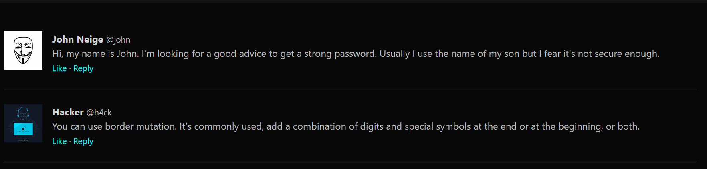

# Hash Cracking Challenge #1

## Challenge Description
Your task is to crack the following hash and find the original password.

## Hash to Crack
```
b16f211a8ad7f97778e5006c7cecdf31
```

## Hint
🔍 **Important:** Check the image below for crucial advice on how to approach this hash cracking challenge!



## Instructions
1. Analyze the hash format and identify the hash type
2. Use the advice provided in the image above to guide your cracking approach
3. Apply appropriate tools and techniques to crack the hash
4. Submit your answer once you've successfully cracked it

## Good Luck!
Use your knowledge of different hash types, wordlists, and cracking techniques. The image contains valuable hints that will help you solve this challenge more efficiently.

---
*Challenge created for hash cracking practice*